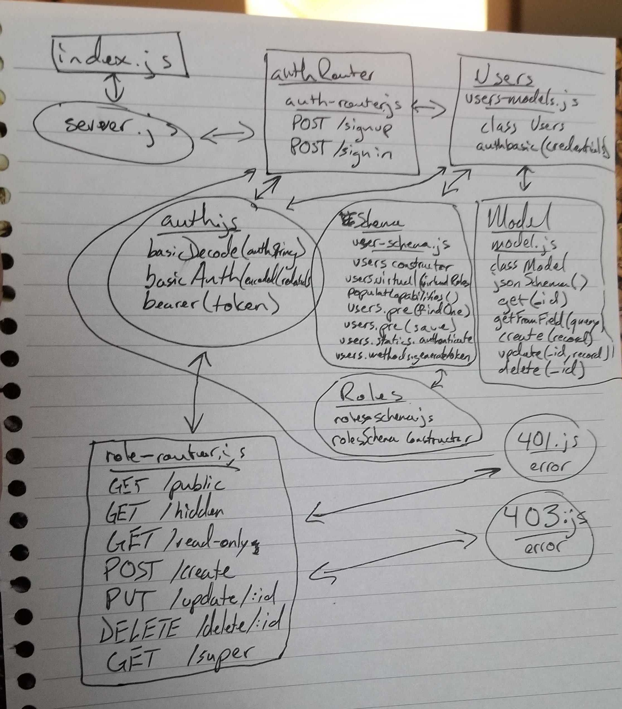

# LAB - 13

### Author: Morgan T Shaw

### Links and Resources
* [submission PR](https://github.com/morgan-401-advanced-javascript/lab13/pull/1)
* [travis](https://travis-ci.com/morgan-401-advanced-javascript/lab13)
* [front-end](https://lab13morgan.herokuapp.com/)

### Setup
#### `.env` requirements
`MONGODB_URI = mongodb://127.0.0.1:27017/app
PORT = 3000
JWT_SECRET = 3a91d829ee92d91c03f94453af275b2a`

#### Running the app
* `npm start`

  
#### Tests
* How do you run tests?
npm test

#### UML
